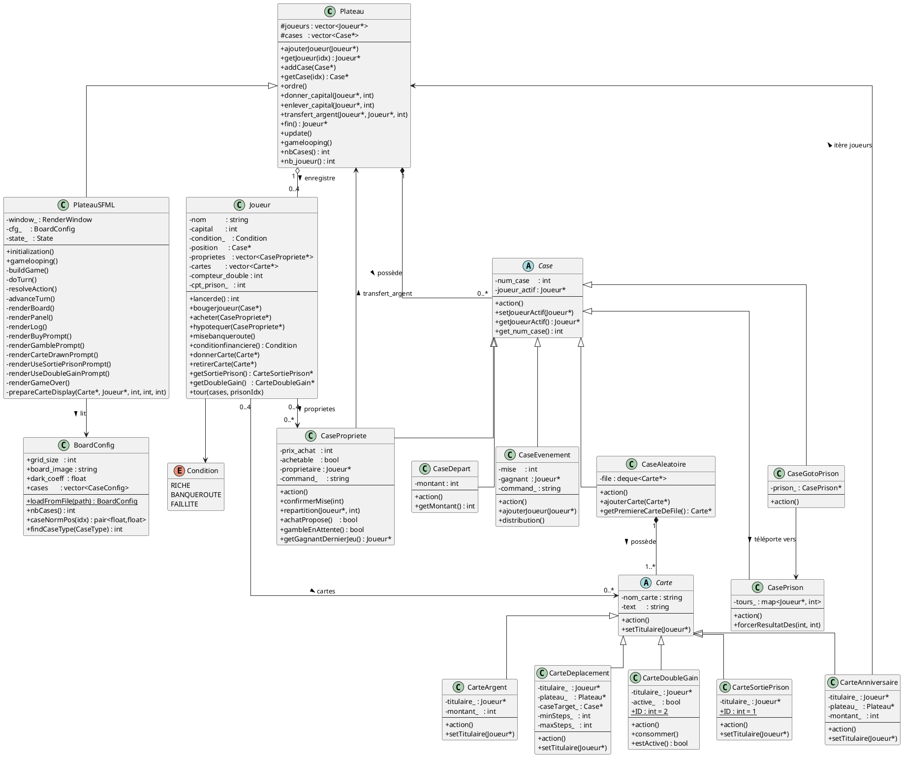
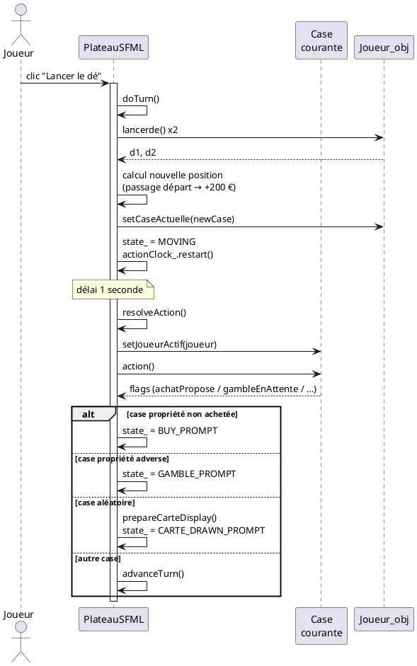
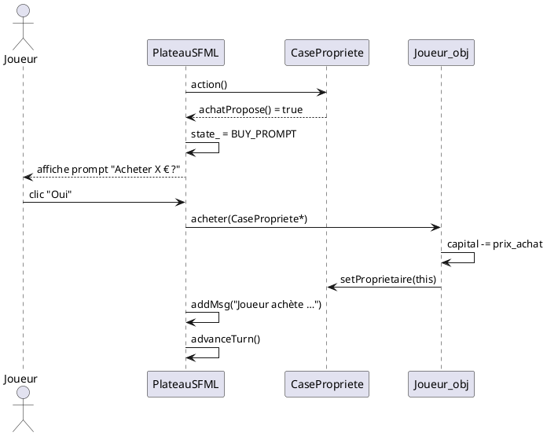
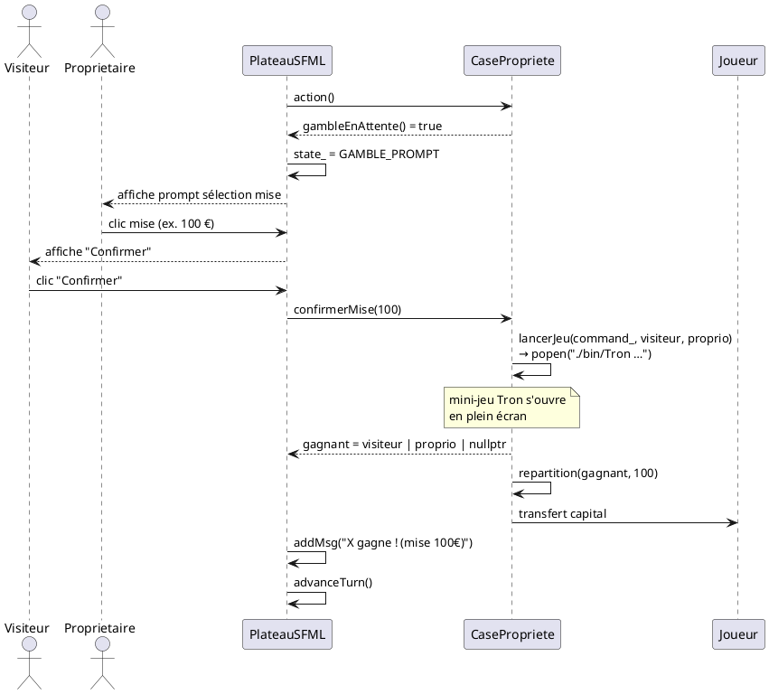
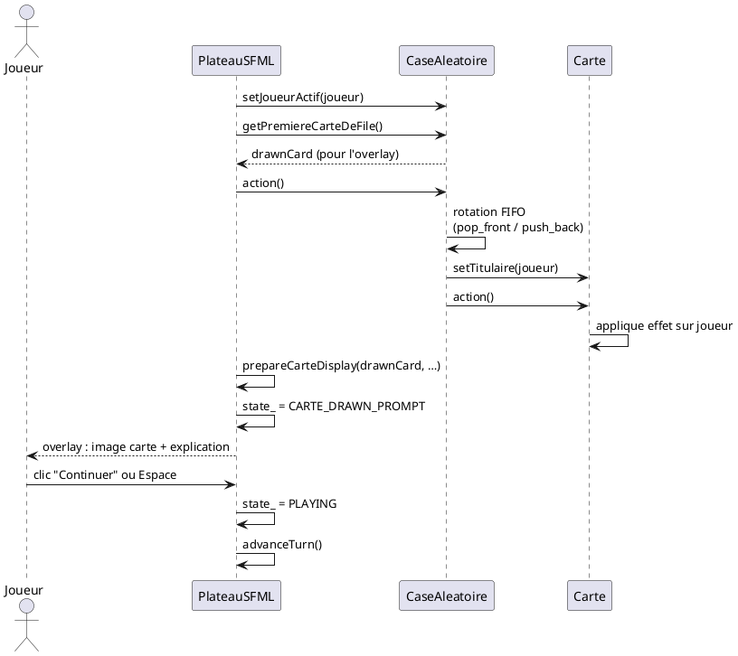
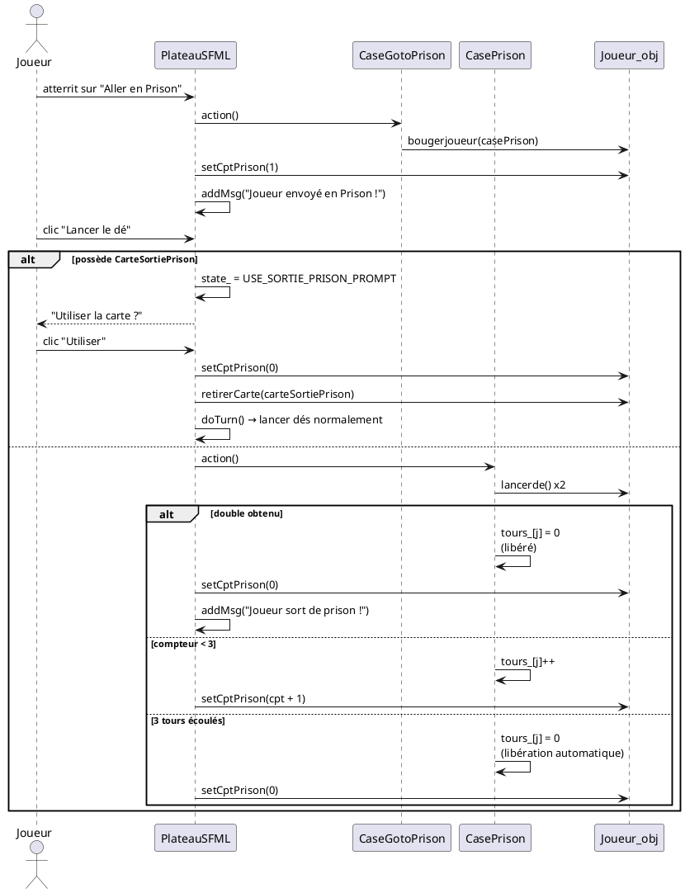

# Rapport — GambleStyle

> Les diagrammes UML ci-dessous sont rédigés en syntaxe **PlantUML**.
> Pour les visualiser : [plantuml.com/plantuml](https://www.plantuml.com/plantuml/uml)
> ou VS Code avec l'extension *PlantUML* (raccourci `Alt+D`).

---

## 1. Guide d'utilisation complet

### 1.1 Démarrage

Lancez le jeu depuis la racine du projet :

```bash
./bin/gamble_run
```

Un écran de configuration s'affiche.

### 1.2 Écran de configuration

| Champ | Description |
|---|---|
| Nombre de joueurs | 2 à 4. Utilisez les boutons `−` / `+`. |
| Noms | Cliquez sur un champ et tapez le nom (Entrée valide). |
| Durée | Durée maximale en minutes (0 = illimitée). |
| Bouton Jouer | Lance la partie après avoir déterminé l'ordre de jeu par les dés. |

L'ordre de jeu est déterminé automatiquement : chaque joueur lance un dé, celui
avec le plus grand résultat joue en premier.

### 1.3 Plateau de jeu

L'interface est divisée en trois zones :

- **Plateau (gauche)** : grille 4×4 avec les cases, les pions des joueurs et les dés.
- **Panneau (droite)** : état de chaque joueur (capital, propriétés, cartes en main)
  et le bouton **Lancer le dé**.
- **Journal (bas)** : derniers événements de la partie.

### 1.4 Déroulement d'un tour

1. Le joueur actif clique sur **Lancer le dé**.
   - Si le joueur est **en prison**, un prompt s'affiche pour utiliser
     la carte Sortie de Prison ou lancer les dés normalement.
2. Les deux dés sont lancés ; le pion se déplace automatiquement.
3. Après 1 seconde, l'effet de la case est résolu (prompt ou animation).
4. Si le joueur fait un **double**, il rejoue automatiquement.
   Trois doubles consécutifs → prison immédiate.
5. Le tour passe au joueur suivant.

### 1.5 Cases et effets détaillés

#### Case Départ
- Verse **200 €** (configurable dans `board.txt`) lorsque le joueur atterrit
  dessus ou la survole.

#### Case Propriété
| Situation | Effet |
|---|---|
| Non achetée | Prompt "Acheter pour X € ?" — Oui ou Non. |
| Propriétaire = joueur actif | Rien. |
| Propriétaire = adversaire | Le propriétaire choisit une mise (50/100/150/200 €). Un duel Tron est lancé. |

**Mise** : le joueur visiteur peut activer sa carte **Double Gain** avant le duel
pour percevoir 2× la mise en cas de victoire.

#### Case Événement
Tous les joueurs actifs s'affrontent dans **DiceBattle**.
Chaque perdant verse sa mise au gagnant.

#### Case Aléatoire
Une carte est piochée dans le deck tournant. Un overlay s'affiche avec l'image de
la carte et une explication. Cliquer **Continuer** (ou `Espace`/`Entrée`) ferme l'overlay.

| Carte | Effet immédiat |
|---|---|
| **Anniversaire** | Chaque adversaire verse X € au joueur (X = paramètre dans `board.txt`). |
| **Argent** | Tirage 50/50 : +X € (gain) ou −X € (perte). |
| **Déplacement** | Avance de 2 à 6 cases aléatoirement. Si passage par le Départ : +200 €. |
| **Double Gain** | Carte conservée en main. Double le gain si utilisée avant un duel de propriété. |
| **Sortie de Prison** | Carte conservée en main. Libère instantanément sans lancer de double. |

#### Station Prison (visite)
Un joueur qui atterrit sur la case par ses dés est simplement en visite — aucun effet.

#### Prison (emprisonné)
Un joueur envoyé en prison par la case "Aller en Prison" ou par triple double :

- Il doit lancer un **double** pour sortir (1 essai par tour).
- Alternativement, il peut utiliser sa **carte Sortie de Prison** avant de lancer.
- Après **3 tours** sans double, il est libéré automatiquement.

#### Aller en Prison
Téléporte immédiatement le joueur vers la Station Prison et démarre le compteur.

### 1.6 Conditions de fin de partie

La partie se termine dans l'un de ces cas :

- Il ne reste qu'**un seul joueur solvable** (capital > 0 ou propriétés non hypothéquées).
- Le **temps configuré** est écoulé.

**Banqueroute** : si le capital d'un joueur passe en dessous de 0, il est en banqueroute.
Il peut appeler `misebanqueroute()` pour liquider ses propriétés à mi-prix.
Si le capital reste ≤ 0 après liquidation → **Faillite** : le joueur est éliminé.

Le **vainqueur** est le joueur avec le score le plus élevé (capital + valeur des propriétés).

---

## 2. Diagramme de classes UML



---

## 3. Diagrammes de séquence

### SD1 — Tour complet



---

### SD2 — Achat de propriété



---

### SD3 — Jeu de propriété (Tron)



---

### SD4 — Carte aléatoire



---

### SD5 — Prison


